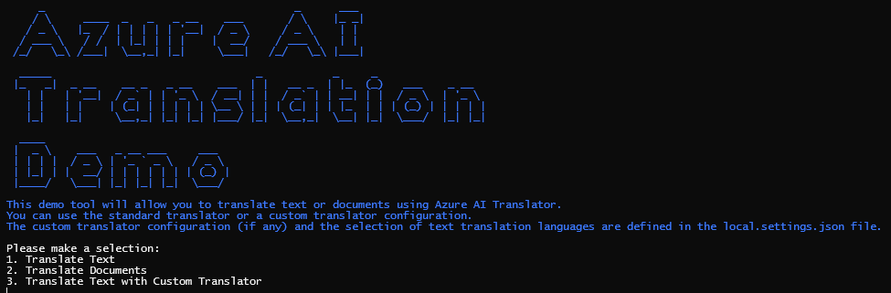

# TranslatorDemo
Demo for Microsoft Translator [Text](https://learn.microsoft.com/en-us/azure/ai-services/translator/text-translation-overview) and [Document](https://learn.microsoft.com/en-us/azure/ai-services/translator/document-translation/overview) Translation

## Get Started

This demo leverages the [Azure AI Services](https://learn.microsoft.com/en-us/azure/ai-services/) Text and Document translation APIs. To get started, you will need to deploy an Azure Translator Service and an Azure storage account. 
To simplify the process, you can edit the [AzureResources/parameters.json](AzureResources/parameters.json) file and run the [AzureResources/Deploy.ps1](AzureResources/Deploy.ps1) script. This will deploy the required resources to your Azure subscription.

This script will also generate a `Properties/launchSettings.json` file that will be used by the demo application to connect to the Azure resources.

To  run the demo, simply run the `TranslatorDemo` project from Visual Studio.

## How to use

When you start the app, it will open a console window and prompt you to enter a tranlation type:

### Text Translation

To translate text, select `1` from the menu. You will be prompted to enter the text you want to translate. You can enter a multiline text. To start the translation, type in or finish the last line with `@` and press `Enter`.

To change the destination languages, edit the `route` variable in the [Program.cs](Program.cs) file.

### Document Translation

To translate documents, first upload them to your storage account's `incoming` container. Next, select `2` from the menu and it will start the translation process. The app will poll the translation service until the translation is complete. Once the translation is complete, the translated documents will be available in the `translated` container.

To change the destination language, edit the `json` variable in the [DocumentTranslation.cs](DocumentTranslation.cs) file.