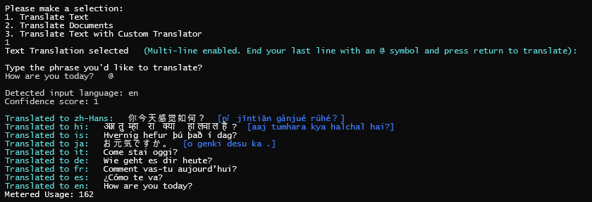
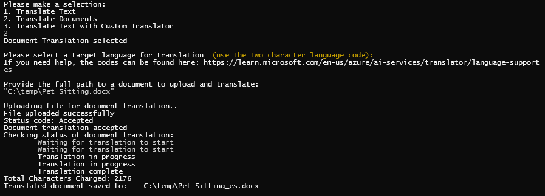
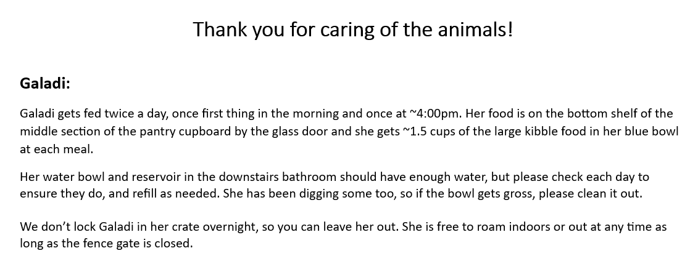
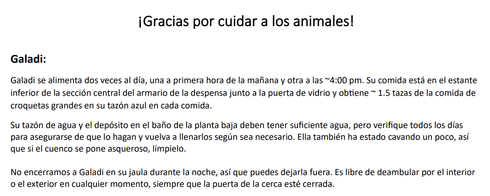

# TranslatorDemo
Demo for Microsoft Translator [Text](https://learn.microsoft.com/en-us/azure/ai-services/translator/text-translation-overview) and [Document](https://learn.microsoft.com/en-us/azure/ai-services/translator/document-translation/overview) Translation. 

## Get Started

This demo leverages the [Azure AI Services](https://learn.microsoft.com/en-us/azure/ai-services/) Text and Document translation APIs. To get started, you will need to deploy an Azure Translator Service and an Azure storage account. 
To simplify the process, you run the [Deploy.ps1](Deploy.ps1) script. This will deploy the required resources to your Azure subscription.

``` Powershell
 .\Deploy.ps1 -resourceGroup "<resource-group-name>" -location "<location>" -translationAcct "<name for your AI account>" -storageAcct "<name for your storage account>"

```

This script will also generate a `local.sessings.json` file that will be used by the demo application to connect to the Azure resources.

The script will then launch the configured demo app for you to use.

## How to use

When you start the app, it will open a console window and prompt you to enter a tranlation type:


### Text Translation

To translate text, select `1` from the menu. You will be prompted to enter the text you want to translate. You can enter a multiline text. To start the translation, type in or finish the last line with `@` and press `Enter`.

To change the destination languages, edit the `TEXT_TRANSLATION_LANGUAGES` values in the `local.settings.config` then rebuild and restart the app.



### Document Translation

To translate documents, select `2` from the menu. This will prompt you first for a target language, then for a local path to the file to translate. 

The app will upload the document to Blob storage and start the translation process. It will monitor the progress of the translation and once complete, it will download the file to the same folder as the source document with the language code appended to the name.

The files will also be available in Blob storage in the `source` and `translated` containers respectively.



#### Original document


#### Translated document


### Custom Text Translation

If you have trained a custom text translator, you can configure this translator in the local.settings.config file with the `CUSTOM_TRANSLATOR_CATEGORY_ID` and `CUSTOM_TRANSLATOR_TO_LANGUAGE` values. 

Once these are set and the application rebuilt, you can select `3` from the menu to translate text using the custom translator.